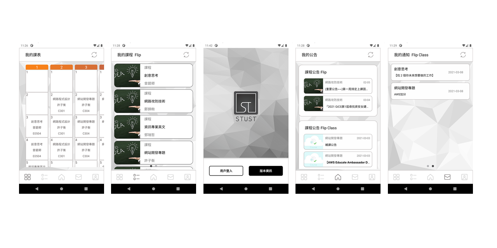
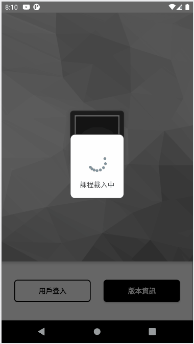
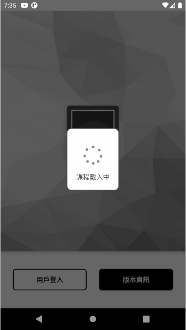

# STUST南台學生助理 ( STUST Student Assistant )
南台學生助手 ( STUST Student Assistant )  整合「南臺消息」、「南臺數位學習系統 ( FLIP / FLIP CLASS )」、「南臺選課系統」中的部分功能與資訊，幫助學生能夠快速瀏覽相關訊，包括「課表」、「課程」、「作業」等內容，目前部分功能尚在測試階段，有相關問題歡迎回報。
請使用校內共通帳戶進行登入。

## 版本資訊
當前版本：v1.0.2

版本變更紀錄： [VESIONLOG.md](VERSIONLOG.md)
## 功能介紹
### 課表瀏覽
* **自動追蹤日期** 
 根據當天日期，課表起始焦點將會自動移動至對應標號。
 如下圖所示：測試日為 `3/7(日)` 因此畫面將會停在`標號 7 ` 
 

* **完整課表內容** 
 您可以透過`點擊`或`滑動`來變更焦點項目，並且如果`點擊`項目與焦點項目相同則會開啟完整內容。
 如下圖所示： 
 

* ~**_顯示上課位置_**~**_( 尚未推出 )_** 
 ~_您可以透過再次`點擊`完整內容中的目標項目來顯示課程所在位置_~。

### 課程瀏覽
* **支援 [Flip](https://flip.stust.edu.tw/) 以及 [Flip Class](https://flipclass.stust.edu.tw/) 課程內容瀏覽** 
 能夠透過`左右滑動`切換 [Flip](https://flip.stust.edu.tw/) 與 [Flip Class](https://flipclass.stust.edu.tw/)，`點擊`後能夠顯示該課程詳細內容。
 如下圖所示： 
 

* **課程內容瀏覽與附件下載** 
 在目前支援的項目內容中，能夠使用`長按`來顯示目標的完整名稱，並且可以透過`點擊`來瀏覽目標詳細內容。
 如下圖所示： 
 

* **支援部分內容瀏覽與附件下載**  
 在「課程活動」、「課程教材」、「課程作業」中目前支援瀏覽的項目如下： 
**_注意：目前並沒有支援「上傳/編輯」等相關功能_**
  *  **[ Flip ]** 簡報教材 ( ppt ) 
  *  **[ Flip ]** 外部連結 ( hyperlink )
  * .png) **[ Flip ]** 已繳交課程作業 ( exercise successful )
  *  **[ Flip / Flip Class ]** 音訊教材 ( mp3 )
  *  **[ Flip / Flip Class ]** 一般文件教材 ( doc )
  *  **[ Flip / Flip Class ]** 課程作業 ( exercsie ) 
  *  **[ Flip / Flip Class ]** 可攜式文件教材 ( pdf )
  *  **[ Flip / Flip Class ]** 嵌入式網頁教材 ( iframe )
  *  **[ Flip / Flip Class ]** 外部影片連結教材 ( embed )
  *  ~**[ Flip Class]** EverCam~ ( 尚未支援 )

### 公告瀏覽
* **支援 [Flip](https://flip.stust.edu.tw/) 以及 [Flip Class](https://flipclass.stust.edu.tw/) 課程公告以及「南台消息」瀏覽** 
 介面中會顯示最新的前5項公告資訊，`點擊`目標則會開啟公告瀏覽視窗，如公告項目總數超出5項，則會在右上方顯示「顯示全部」功能按鍵，`點擊`後則會跳轉至完整的公告頁面。
 如下圖所示： 
 

### 通知瀏覽
* **支援 [Flip](https://flip.stust.edu.tw/) 以及 [Flip Class](https://flipclass.stust.edu.tw/) 課程作業與測驗通知** 
 介面中能夠透過左右`滑動`來切換 [Flip](https://flip.stust.edu.tw/) 以及 [Flip Class](https://flipclass.stust.edu.tw/) ，並且`點擊`項目之後則會顯示通知內容。
 如下圖所示： 
 

* ~**_通知提醒功能_**~**_( 尚未推出 )_** 
 ~_您可以透過個人設定項目中的「通知提醒」自訂通知提醒時間，系統將會在到期日前提發送通知醒您_~。

### 個人設定
* **帳號資訊以及相關設定** 
 能夠查看當前使用者的用戶資訊，並且能根據使用者習慣更改其設定內容。  
  * **用戶資訊** — 查看當前使用者資訊。
  * **通知提醒** — 設定通知提醒時間。
  * **初始畫面** — 設定初始畫面項目。
  * **同步課表** — 系統啟動時會將已取得課表與課程內容進行比對，如不相符則會再次取得課表內容。
  * **離線模式** — 啟用此模式將不會檢測網路狀態，會直接採用本地課表進行瀏覽。
  

